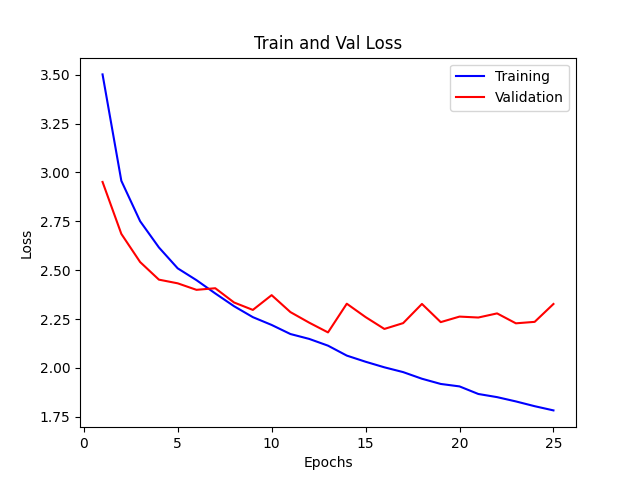
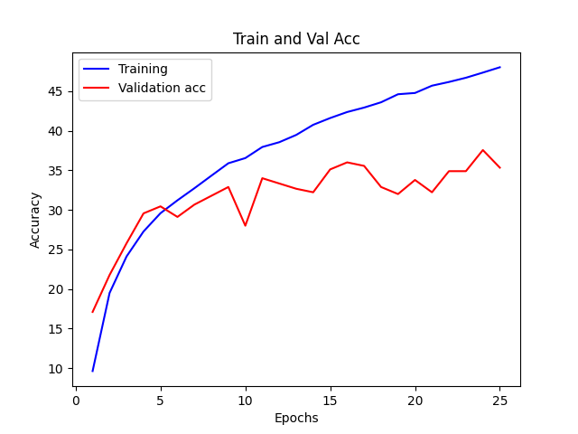
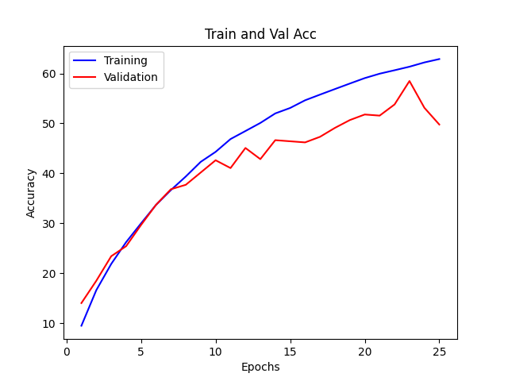
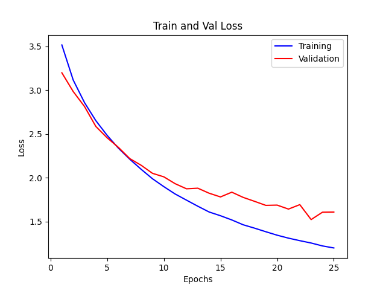
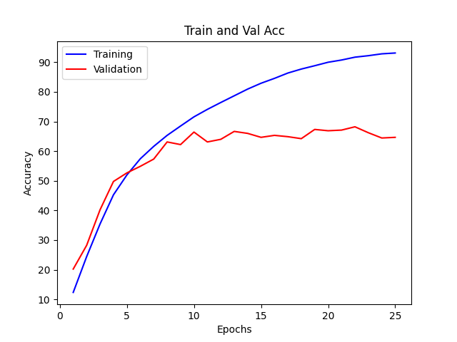
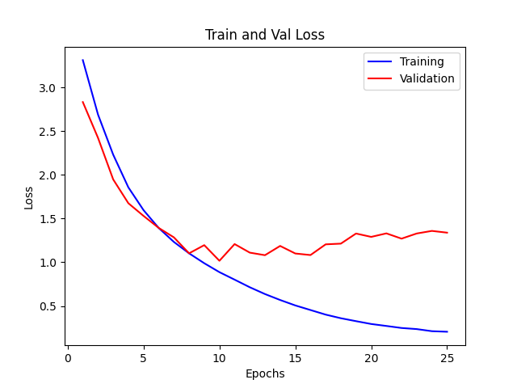

# Task 1 : Designing a Convolution Module for Variable Input Channels

## Overview
This project involves designing a convolutional neural network (CNN) that is capable of handling an arbitrary number of input channels. The primary task is to implement a special convolution module that is invariant to spatial size and can dynamically adjust to different input channels.

## Method
### Data Preprocessing
- **Image Resizing**: Since images vary in size, we resize all images to 256x256 pixels.
- **Data Augmentation**: Enhance the dataset using techniques like random horizontal flipping and rotation to improve the model's generalization ability.

### Channel Processing
- **Single Channel**: Duplicate the channel twice to create three identical channels, ensuring compatibility with the RGB format.
- **Double Channel**: Add an empty channel filled with zeros and append it to the existing two channels to form a three-channel image.
- **More than Three Channels**: Simplify by only utilizing the first three channels, disregarding any extra channels.

### Channel Mapping
- **Single Channel to Three Channels**: To effectively learn the transformations required to convert grayscale images to a pseudo-RGB format, we train a convolutional layer to map single-channel images to three channels.
- **Double Channel to Three Channels**: Similarly, we train another convolutional layer to map two-channel images to three-channel images, ensuring consistent channel numbers for all input images.

## Result
Overall, the model is able to learn from the data, improving accuracy and reducing loss. However, there is still a slight overfitting issue that needs to be addressed.
|Loss|Accuracy (%)|
|---|---|
|||

And evaluate its performance on images with various channel combinations (such as RGB, RG, GB, R, G, B, etc.) during inference.

| Combination | RGB   | RG    | GB    | R     | G     | B     |
| ----------- | ----- | ----- | ----- | ----- | ----- | ----- |
| Accuracy (%)   | 35.11 | 19.11 | 13.78 | 25.78 | 25.33 | 22.0 |

## Setup
```bash
git clone https://github.com/Sherry2580/Deep-Learning-Assignment-II.git
```
```bash
cd DL-Assignment-II/DL-Task
```
```bash
pip install -r requirements.txt
```
- Download Dataset: [Mini-ImageNet](https://cchsu.info/files/images.zip)

    Run the command below to download and unzip the dataset.
```bash
bash scripts/download_dataset.sh
```

## Usage
Follow the steps below to prepare the dataset, train the model, and test the model.
1. Preprocess The Dataset
2. Train The Model (optional)
3. Test The Model

### Preprocess The Dataset
Make sure you have already unzip the `images.zip` to the data folder.

Run `data_preprocessing.py` to preprocess the dataset.
```bash
python src/data_preprocessing.py
```

### Train The Model (optional)
We have provided the pre-trained model, you can directly move to the [next step](#test-the-model). 

If you want to train the model, please run `train.py`
```bash
python src/train.py
```

### Test The Model
We provide the pre-trained model, if you want to reproduce our experimental results., you have to run the command below in the **./DL-Assignment-II/DL-Task** fodler.
```bash
bash scripts/download_pretrained_weight.sh
```
then you can directly run `test.py` for dataset testing.
```bash
python src/test.py
```

# Task 2 : Designing a Two-Layer Network for Image Classification

## Overview
The objective is to design a (2-4)-layer convolutional neural network (CNN), Transformer, or recurrent neural network (RNN) that achieves 90% of the performance of ResNet34 on the ImageNet-mini dataset.

## Result

| Model       | Accuracy (%) | 
|-------------|--------------|
| ComplexCNN  | 58.667       |
| ResNet34    | 67.778       |

### ComplexCNN

| Accuracy                                             | Loss                                             |
|------------------------------------------------------|--------------------------------------------------|
|  |  |

### ResNet34

| Accuracy                                             | Loss                                             |
|------------------------------------------------------|--------------------------------------------------|
|  |  |

### Analysis

The results indicate that the performance of the designed two-layer network (ComplexCNN) was evaluated against ResNet34. Despite showing promising results, the ComplexCNN marginally fell short of achieving 90% of ResNet34's performance on ImageNet-mini. The experimental results indicate that with further refinements, the designed model has the potential to reach and even surpass the target benchmark.

## Usage
Make sure that you have already finish [Setup](#setup) and [Preprocess The Dataset](#preprocess-the-dataset).
### Train The Model (optional)
- 想要訓練此次設計的模型 **ComplexCNN** ，可以在 `./Deep-Learning-Assignment-II/DL-Task`目錄之下，運行
```bash
python src/train.py --model_type ComplexCNN
```
- 想要訓練 **ResNet34** ，可以在同樣目錄下，運行
```bash
python src/train.py --model_type ResNet34
```
### Test The Model
We provide the pre-trained model, if you want to reproduce our experimental results., you have to run the command below in the `./DL-Assignment-II/DL-Task` fodler.
```bash
bash scripts/download_pretrained_weight.sh
```
then you can directly test model with our pretrained weight.

- 如要測試 **ComplexCNN** 模型，在相同目錄下，運行
```bash
python src/test.py --model_type ComplexCNN
```
- 想要測試 **ResNet34** 模型，在相同目錄下，運行
```bash
python src/test.py --model_type ResNet34
```


